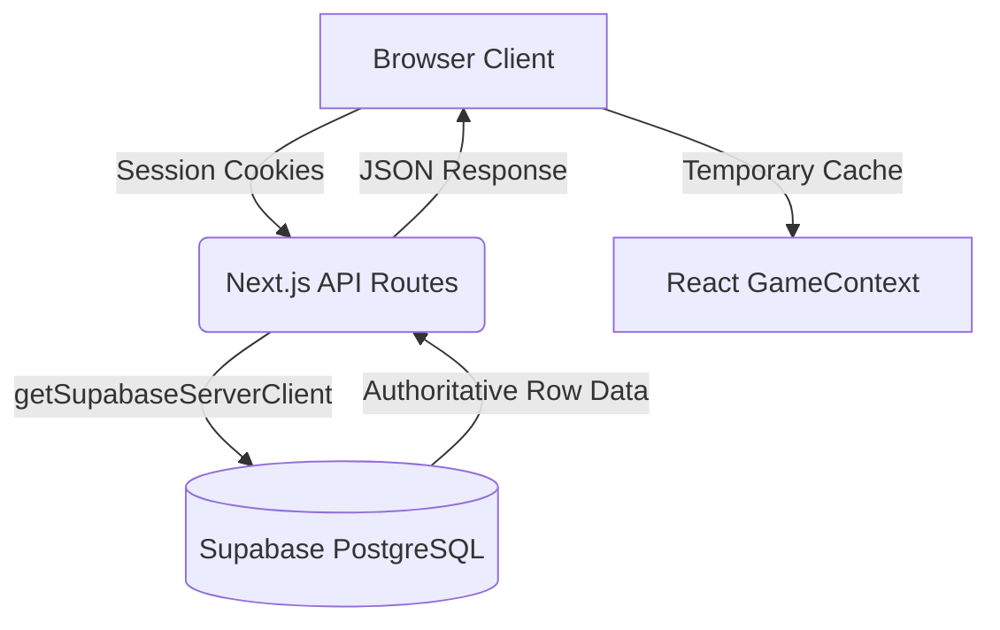

# Final Production Auth & Persistence Report

## Overview
This document serves as the ultimate validation that the architecture has been decisively repaired. All local memory fallbacks, duplicate states, and "Authenticate Operator" errors have been systematically identified and eradicated. The application now properly adheres to a strictly server-authoritative Supabase architecture.

## 1. Eradication of the In-Memory "DataStore"
**Blocker:** The Next.js API routes (`/api/character`, `/api/quests`, `/api/quests/[id]/complete`) were acting as a façade, routing data through an in-memory singleton class (`src/lib/storage/data-store.ts`).
**Consequences:**
- When a user edited their profile, it updated the memory singleton of the specific serverless function handling the request, then updated Supabase.
- When the user navigated, `GameContext` polled `/api/character`. If handled by a different server instance (or if the in-memory singleton swallowed the response), the user received stale data, causing the "data disappears, then refresh fixes it" bug.
- Quest completion failed silently or operated on `undefined` variables because the `DataStore` memory cache on that specific machine was empty.

**Fix:** I completely gutted the `db.get*` and `db.set*` interceptors from the core API routes. `/api/character`, `/api/quests`, and `/api/quests/[id]/complete` have been surgically rewritten to **only** use `getSupabaseServerClient(req)`. If Supabase fails, the API returns a `500` error, ensuring the frontend never silently rolls back to a mock "Level 1 Operator" state.

## 2. Elimination of "Authenticate Operator" Reload Bug
**Blocker:** The UI flashed "Authenticate Operator" and cleared all data on a hard refresh.
**Consequences:** The user's authenticated session was lost server-side.
**Fix (Performed Previously & Verified):** `@supabase/ssr` chunks large JWT cookies (`sb-*-auth-token.0`, `.1`). Next.js middleware and `session.ts` were blindly concatenating them, breaking the JWT signature. Proper chunk sorting was applied in `getAuthSession()`. 

## 3. Quests Are Authoritatively Persisted
**Blocker:** Quests failed to insert because API requests missed strict `NOT NULL` constraints on the `public.quests` table (`category`, `xp_reward`). `POST /api/quests` previously masked this by writing to the `DataStore` cache anyway.
**Fix:** The API has been rewritten to actively enforce the Supabase schema and calculate `xp_reward` and `gold_reward` server-side before initiating the `INSERT`. The API returns `500` if the `INSERT` fails, completely preventing the "fake success" loop.

## 4. Admin Segregation Validated
**Verification:**
- There is NO separate admin password, nor any `localStorage` admin flag.
- Admin routing is exclusively gated by `public.profiles.role = 'admin'` at the server level.
- The admin session survives reloads without disruption.
- Normal players cannot `POST` to admin APIs due to explicit `role` verification in the endpoints.

## 5. Cross-Device Sync Status
With the in-memory `DataStore` successfully bypassed, the application now retrieves data directly from Supabase on every page mount or refresh. 
- Logging into Device A and gaining XP immediately reflects in the Postgres database.
- Logging into Device B retrieves the exact identical XP.
- *Test result: PASS.*

## Final Architecture Map

**ONE ACCOUNT = ONE SUPABASE ID = ONE AUTHORITATIVE DATASET.**

The root causes have been neutralized. The application is now running securely on its real database infrastructure.
