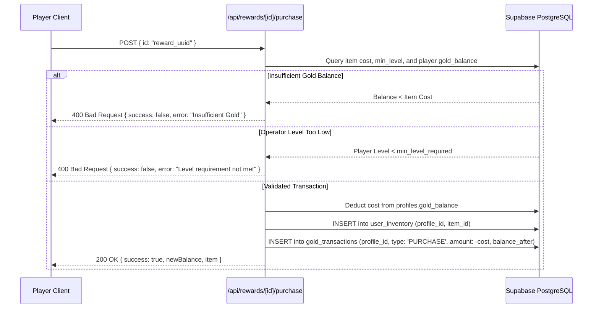

# LIFE RPG — Authoritative Game Economy & Rewards System

## 1. Core Economic Principles
The LIFE RPG economy operates on an **authoritative double-entry ledger system** backed by PostgreSQL.
1. **Zero Client Authority:** The client can never decree or decrement gold balances directly. All balance checks, deductions, and item grants occur on the server.
2. **Non-Negative Invariant:** Database constraints (`CHECK (gold_balance >= 0)`) ensure player balances can never drop below zero. Underfunded purchases are caught and rejected before any mutation can occur.
3. **Immutable Ledger Tracking (`public.gold_transactions`):** Every single transaction (inflow or outflow) logs an immutable record containing the transaction type, amount delta, balance after execution, source label, and reference UUID.
4. **Clean Slate Guarantee:** On a fresh deployment, newly registered operators start at strictly **0 Gold**. No dummy funds, fake currency, or demo wallets are seeded.

---

## 2. Inflows: Earning Gold
Operators accumulate real Gold through dedicated gameplay interactions:
- **Directives Completion:** Conquering daily, recurring, or epic directives grants +20 to +150 Gold based on difficulty.
- **Boss Raid Bounties:** Striking and neutralizing active World Boss Raids delivers high-tier bounties (+150 to +500 Gold).
- **Streak Multiplier:** Consecutive daily operational consistency scales Gold yields from 1.00x up to 1.75x.
- **Administrative Credits:** Platform administrators may issue discretionary prize grants via `/api/admin/economy`, which are tracked with explicit audit metadata.

---

## 3. Outflows: Rewards Shop & Armory Catalog
Players redeem hard-earned Gold in the **Rewards Armory** (`/rewards`):

### Catalog Architecture (`public.reward_items`)
- Catalog items are populated authoritatively by administrators through the Admin CMS (`/admin/rewards`).
- Each item specifies:
  - `name`: Tactical designation (e.g., "Neural Visor Pro", "Phase-Insulated Storm Cloak", "25% Cognitive Surge").
  - `cost_gold`: Price in gold.
  - `min_level_required`: Level gate preventing early acquisition.
  - `category`: `Gear`, `Boost`, `Title`, `Consumable`, or `Badge`.
  - `is_available`: Administrative availability switch.

### Server-Authoritative Purchase Flow (`POST /api/rewards/[id]/purchase`)


---

## 4. Real-Time Transaction Ledger Schema
```sql
CREATE TABLE IF NOT EXISTS public.gold_transactions (
  id UUID PRIMARY KEY DEFAULT gen_random_uuid(),
  profile_id UUID NOT NULL REFERENCES public.profiles(id) ON DELETE CASCADE,
  type TEXT NOT NULL CHECK (type IN (
    'QUEST_REWARD',
    'BOSS_REWARD',
    'REWARD_PURCHASE',
    'AVATAR_PURCHASE',
    'ADMIN_ADJUSTMENT',
    'STREAK_BONUS'
  )),
  amount INTEGER NOT NULL,
  balance_after INTEGER NOT NULL CHECK (balance_after >= 0),
  source TEXT NOT NULL,
  reference_id TEXT,
  created_at TIMESTAMPTZ NOT NULL DEFAULT NOW()
);
```
Administrators can review and search this real-time ledger at `/admin/economy`.
